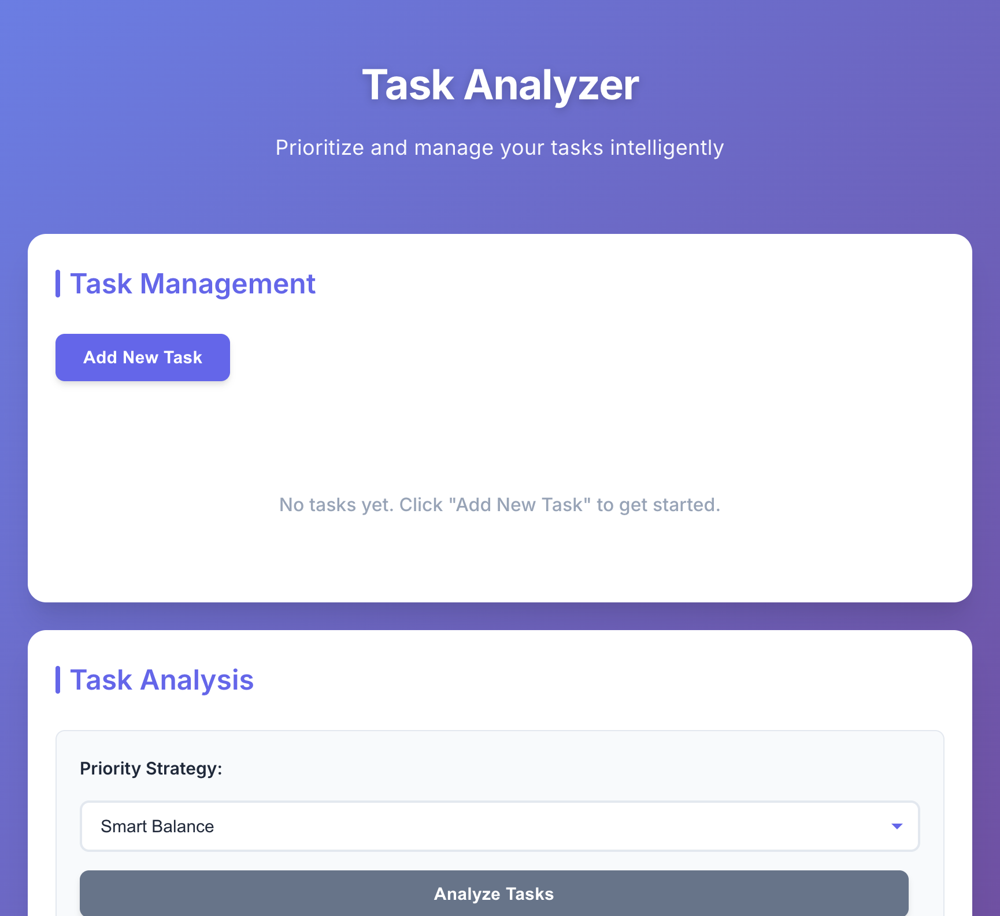
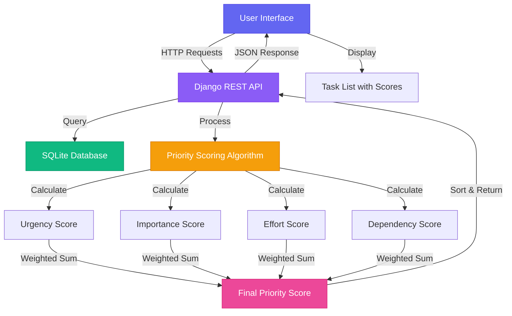
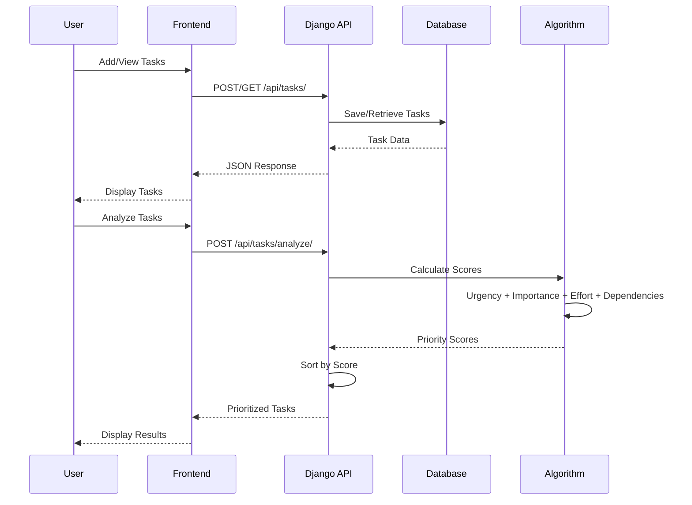
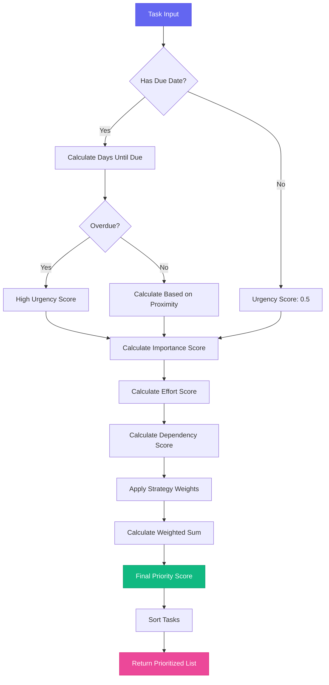
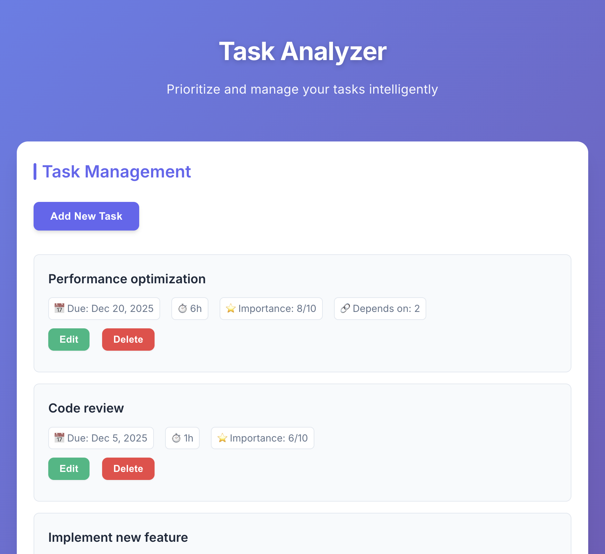
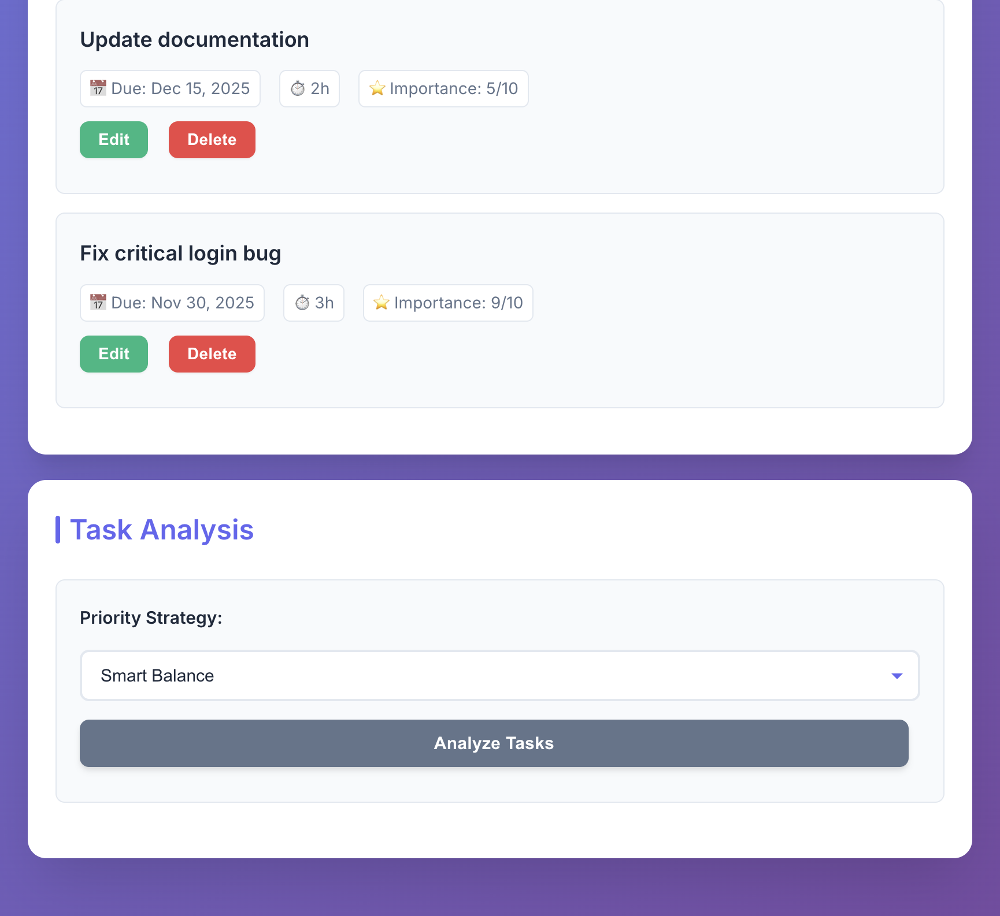
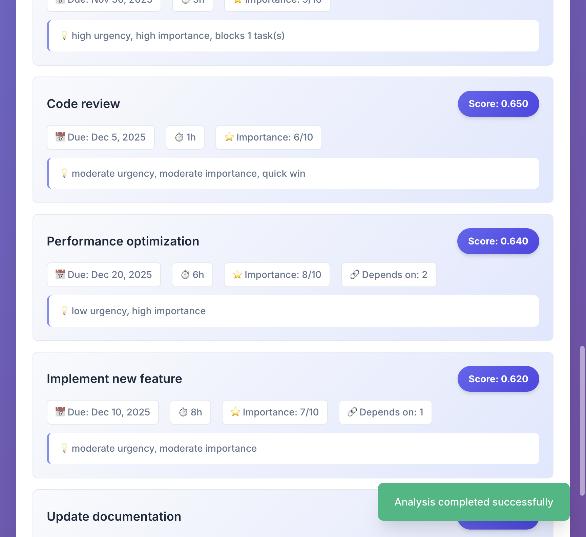

# Task Analyzer - Smart Task Prioritization System

A comprehensive Django REST API application with an intelligent task management and prioritization system. This application helps users prioritize tasks based on multiple factors including urgency, importance, effort, and dependencies.



## 📋 Table of Contents

- [Overview](#overview)
- [Features](#features)
- [Technology Stack](#technology-stack)
- [Architecture & Design](#architecture--design)
- [Installation](#installation)
- [Usage](#usage)
- [API Documentation](#api-documentation)
- [Priority Scoring Algorithm](#priority-scoring-algorithm)
- [Screenshots](#screenshots)
- [Testing](#testing)
- [Project Structure](#project-structure)
- [Approach & Design Decisions](#approach--design-decisions)
- [Future Improvements](#future-improvements)

## 🎯 Overview

Task Analyzer is a full-stack web application that intelligently scores and prioritizes tasks using a sophisticated algorithm. The system considers multiple factors to help users identify which tasks they should work on first, making it ideal for project management and personal productivity.

### Key Highlights

- **Intelligent Prioritization**: Multi-factor scoring algorithm that balances urgency, importance, effort, and dependencies
- **Multiple Strategies**: Four different prioritization strategies to match different work styles
- **Circular Dependency Detection**: Automatically detects and prevents circular task dependencies
- **Modern UI/UX**: Clean, responsive interface with excellent user experience
- **RESTful API**: Well-structured API endpoints for all operations
- **Comprehensive Testing**: 46 unit tests covering all functionality

## ✨ Features

### Core Features

1. **Task Management**
   - Create, read, update, and delete tasks
   - Task fields: title, due date, estimated hours, importance (1-10), dependencies
   - Automatic validation and error handling

2. **Intelligent Analysis**
   - Priority scoring based on multiple factors
   - Four different prioritization strategies
   - Detailed explanations for each task's priority score
   - Circular dependency detection

3. **Multiple Prioritization Strategies**
   - **Smart Balance**: Balanced approach across all factors (default)
   - **Fastest Wins**: Prioritizes quick tasks (low effort)
   - **High Impact**: Focuses on important tasks
   - **Deadline Driven**: Emphasizes urgent tasks

4. **User Interface**
   - Modern, responsive design
   - Real-time task analysis
   - Visual priority indicators
   - Toast notifications for user feedback
   - Mobile-friendly layout

## 🛠 Technology Stack

### Backend
- **Django 4.2.7**: Web framework
- **Django REST Framework 3.14.0**: API development
- **django-cors-headers 4.3.1**: Cross-origin resource sharing
- **SQLite**: Database (default Django setup)

### Frontend
- **HTML5**: Structure
- **CSS3**: Styling with modern design patterns
- **JavaScript (ES6+)**: Interactive functionality
- **Google Fonts (Inter)**: Typography

## 🏗 Architecture & Design

### System Architecture Flow



### Data Flow



### Priority Scoring Algorithm Flow



## 📦 Installation

### Prerequisites

- Python 3.9 or higher
- pip (Python package manager)

### Setup Instructions

1. **Clone the repository**
   ```bash
   git clone <repository-url>
   cd task-analyzer/backend
   ```

2. **Create and activate virtual environment**
   ```bash
   python3 -m venv venv
   source venv/bin/activate  # On Windows: venv\Scripts\activate
   ```

3. **Install dependencies**
   ```bash
   pip install -r requirements.txt
   ```

4. **Run database migrations**
   ```bash
   python manage.py migrate
   ```

5. **Create superuser (optional, for admin access)**
   ```bash
   python manage.py createsuperuser
   ```

6. **Start the development server**
   ```bash
   python manage.py runserver
   ```

7. **Start the frontend server** (in a new terminal)
   ```bash
   cd frontend
   python3 -m http.server 5500
   ```

8. **Access the application**
   - Frontend: http://localhost:5500
   - Backend API: http://localhost:8000
   - Admin Panel: http://localhost:8000/admin

## 🚀 Usage

### Adding Tasks

1. Click the "Add New Task" button
2. Fill in the task details:
   - **Title** (required): Task name
   - **Due Date** (optional): When the task is due
   - **Estimated Hours** (optional): How long it will take
   - **Importance** (1-10): How important the task is
   - **Dependencies** (optional): Comma-separated task IDs
3. Click "Save"


### Analyzing Tasks

1. Ensure you have tasks added to the system
2. Select a priority strategy from the dropdown:
   - Smart Balance (default)
   - Fastest Wins
   - High Impact
   - Deadline Driven
3. Click "Analyze Tasks"
4. View the prioritized results with scores and explanations





## 📡 API Documentation

### Base URL
```
http://localhost:8000/api
```

### Endpoints

#### 1. List All Tasks
```http
GET /api/tasks/
```

**Response:**
```json
[
  {
    "id": "1",
    "title": "Fix login bug",
    "due_date": "2025-11-30",
    "estimated_hours": 3.0,
    "importance": 9,
    "dependencies": [],
    "created_at": "2025-11-27T08:36:51.235313+00:00",
    "updated_at": "2025-11-27T08:36:51.235325+00:00"
  }
]
```

#### 2. Create Task
```http
POST /api/tasks/
Content-Type: application/json

{
  "title": "Fix login bug",
  "due_date": "2025-11-30",
  "estimated_hours": 3,
  "importance": 8,
  "dependencies": []
}
```

#### 3. Get Task Details
```http
GET /api/tasks/<id>/
```

#### 4. Update Task
```http
PUT /api/tasks/<id>/
Content-Type: application/json

{
  "title": "Updated title",
  "importance": 9
}
```

#### 5. Delete Task
```http
DELETE /api/tasks/<id>/
```

#### 6. Analyze Tasks
```http
POST /api/tasks/analyze/?strategy=smart_balance
Content-Type: application/json

[
  {
    "id": "1",
    "title": "Task 1",
    "due_date": "2025-12-15",
    "estimated_hours": 2.0,
    "importance": 8,
    "dependencies": []
  },
  {
    "id": "2",
    "title": "Task 2",
    "due_date": "2025-12-20",
    "estimated_hours": 6.0,
    "importance": 5,
    "dependencies": ["1"]
  }
]
```

**Response:**
```json
{
  "tasks": [
    {
      "id": "1",
      "title": "Task 1",
      "due_date": "2025-12-15",
      "estimated_hours": 2.0,
      "importance": 8,
      "dependencies": [],
      "priority_score": 0.8234,
      "explanation": "high urgency, high importance, quick win"
    }
  ],
  "strategy": "smart_balance",
  "total_tasks": 2
}
```

#### 7. Get Task Suggestions
```http
GET /api/tasks/suggest/?strategy=smart_balance
```

**Response:**
```json
{
  "suggestions": [
    {
      "id": "1",
      "title": "Fix login bug",
      "due_date": "2025-11-30",
      "estimated_hours": 3.0,
      "importance": 9,
      "dependencies": [],
      "priority_score": 0.8525,
      "explanation": "high urgency, high importance"
    }
  ],
  "strategy": "smart_balance",
  "total_available": 5
}
```

## 🧮 Priority Scoring Algorithm

The priority scoring algorithm calculates task priority using a weighted formula that considers four key factors:

### Scoring Components

1. **Urgency (35% weight by default)**
   - Based on due date proximity
   - Overdue tasks get highest scores (0.9+)
   - Tasks due today: 1.0
   - Tasks due tomorrow: 0.95
   - Decreasing scores for future dates
   - No due date: 0.5 (neutral)

2. **Importance (30% weight by default)**
   - User-defined rating (1-10 scale)
   - Normalized to 0.1 - 1.0 range
   - Direct mapping: importance / 10

3. **Effort (20% weight by default)**
   - Inverse relationship (lower effort = higher score)
   - Quick wins (≤1 hour): 1.0
   - 2 hours: 0.9
   - 4 hours: 0.7
   - 8 hours: 0.5
   - 16+ hours: 0.1

4. **Dependencies (15% weight by default)**
   - Number of tasks blocked by this task
   - No blockers: 0.5 (neutral)
   - 1 blocker: 0.7
   - 2 blockers: 0.8
   - 3+ blockers: 0.9-1.0

### Strategy Weights

| Strategy | Urgency | Importance | Effort | Dependencies |
|----------|---------|------------|--------|---------------|
| **Smart Balance** | 35% | 30% | 20% | 15% |
| **Fastest Wins** | 20% | 20% | 50% | 10% |
| **High Impact** | 20% | 60% | 10% | 10% |
| **Deadline Driven** | 70% | 15% | 10% | 5% |

### Formula

```
Priority Score = (Urgency × W_urgency) + 
                 (Importance × W_importance) + 
                 (Effort × W_effort) + 
                 (Dependencies × W_dependencies)
```

Where W represents the weight for each factor based on the selected strategy.

## 📸 Screenshots

### Homepage
The main interface showing the task management and analysis sections.


### Add Task Modal
Form for creating new tasks with all required fields.


### Tasks List
View of multiple tasks with their details and action buttons.


### Analysis Results
Prioritized tasks with scores and explanations displayed.


### Different Strategy
Results using a different prioritization strategy (Fastest Wins).



## 🧪 Testing

The project includes comprehensive test coverage with 46 unit tests.

### Running Tests

```bash
cd backend
python manage.py test
```

### Test Coverage

- **Model Tests**: Validation, edge cases, overdue detection
- **Scoring Algorithm Tests**: All scoring functions, strategies, edge cases
- **API Tests**: All endpoints, error handling, circular dependencies
- **Integration Tests**: End-to-end functionality

### Test Results
```
Ran 46 tests in 0.013s
OK
```

## 📁 Project Structure

```
task-analyzer/
├── backend/
│   ├── manage.py
│   ├── requirements.txt
│   ├── db.sqlite3
│   ├── task_analyzer/
│   │   ├── __init__.py
│   │   ├── settings.py
│   │   ├── urls.py
│   │   ├── wsgi.py
│   │   └── asgi.py
│   └── tasks/
│       ├── __init__.py
│       ├── models.py          # Task model
│       ├── views.py            # API endpoints
│       ├── serializers.py      # Data validation
│       ├── scoring.py          # Priority algorithm
│       ├── urls.py             # URL routing
│       ├── admin.py            # Admin interface
│       └── tests.py            # Unit tests
├── frontend/
│   ├── index.html              # Main HTML
│   ├── styles.css              # Styling
│   └── app.js                  # JavaScript logic
├── screenshots/                 # Application screenshots
└── README.md                    # This file
```

## 💡 Approach & Design Decisions

### Algorithm Design

**Problem**: How to intelligently prioritize tasks considering multiple competing factors?

**Solution**: Weighted scoring system that:
1. **Normalizes different metrics** to a 0-1 scale for fair comparison
2. **Uses configurable weights** to allow different prioritization strategies
3. **Handles edge cases** like missing data, overdue tasks, circular dependencies
4. **Provides explanations** so users understand why tasks are prioritized

**Key Design Decisions**:
- **Urgency scoring**: Exponential decay for future dates, penalty for overdue
- **Effort scoring**: Inverse relationship to prioritize "quick wins"
- **Dependency scoring**: Rewards tasks that unblock others
- **Strategy system**: Allows users to adapt to different work styles

### Code Architecture

**Backend**:
- **Django ORM**: For database operations and data validation
- **REST Framework**: For clean API design and serialization
- **Separation of concerns**: Models, views, serializers, and scoring logic are separate
- **Error handling**: Comprehensive validation and user-friendly error messages

**Frontend**:
- **Vanilla JavaScript**: No framework dependencies for simplicity
- **Modern CSS**: CSS variables, flexbox, grid for responsive design
- **Progressive enhancement**: Works without JavaScript for basic functionality
- **Accessibility**: Semantic HTML, ARIA labels, keyboard navigation

### UI/UX Design

**Color Palette**:
- Primary: Indigo (#6366f1) - Professional and modern
- Success: Green (#10b981) - Positive actions
- Danger: Red (#ef4444) - Destructive actions
- Neutral grays for text and backgrounds

**Typography**:
- Inter font from Google Fonts - Clean, readable, modern
- Clear hierarchy with different font sizes and weights
- Adequate line height for readability

**Layout**:
- Two-column grid on desktop, single column on mobile
- Card-based design for visual separation
- Consistent spacing using a 4px grid system
- Smooth animations and transitions for better UX

### Database Design

**Task Model**:
- Simple, normalized structure
- JSONField for dependencies (flexible, allows future expansion)
- Timestamps for tracking creation and updates
- Validation at model level for data integrity

**Why SQLite?**:
- Perfect for development and small to medium deployments
- No additional setup required
- Easy to migrate to PostgreSQL/MySQL for production
- Sufficient for assignment requirements

## 🔮 Future Improvements

### Potential Enhancements

1. **User Authentication**
   - Multi-user support
   - Task ownership and sharing
   - User preferences for strategies

2. **Advanced Features**
   - Task categories and tags
   - Recurring tasks
   - Task templates
   - Bulk operations

3. **Analytics & Reporting**
   - Task completion tracking
   - Time spent vs estimated
   - Productivity metrics
   - Historical analysis

4. **Integration**
   - Calendar integration
   - Email notifications
   - Export to CSV/PDF
   - API webhooks

5. **Performance**
   - Caching for frequently accessed data
   - Database indexing optimization
   - Pagination for large task lists

6. **UI Enhancements**
   - Dark mode
   - Drag-and-drop task reordering
   - Kanban board view
   - Gantt chart visualization

## 📝 License

This project is part of a technical assessment submission.

## 👤 Author

Developed as part of a Software Development Intern position assessment.

---

**Note**: This application demonstrates problem-solving skills, clean code practices, and understanding of full-stack development principles. The priority scoring algorithm is designed to be flexible and extensible, allowing for future enhancements and customization.

